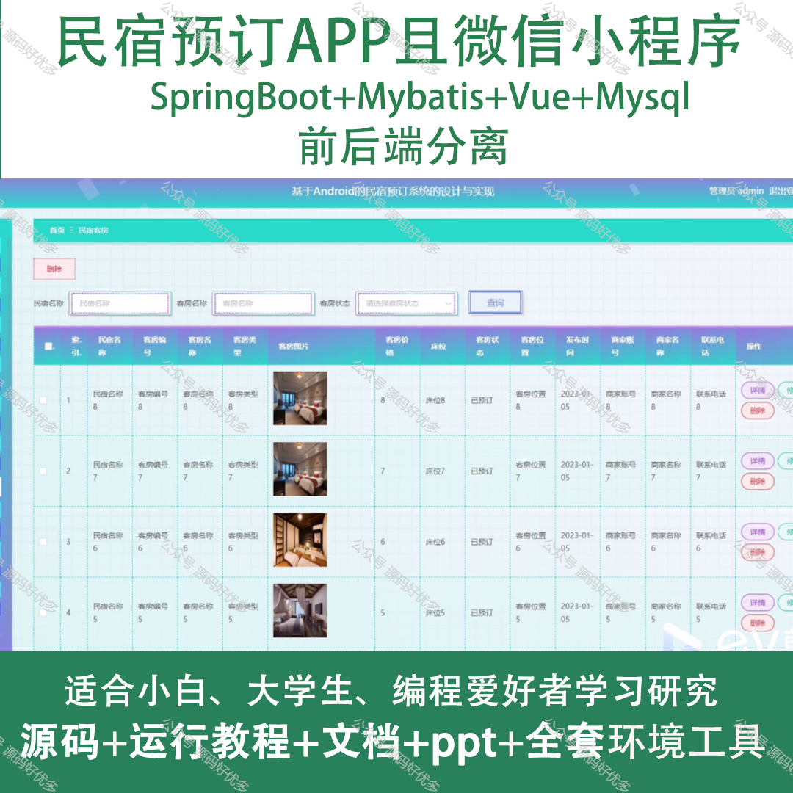
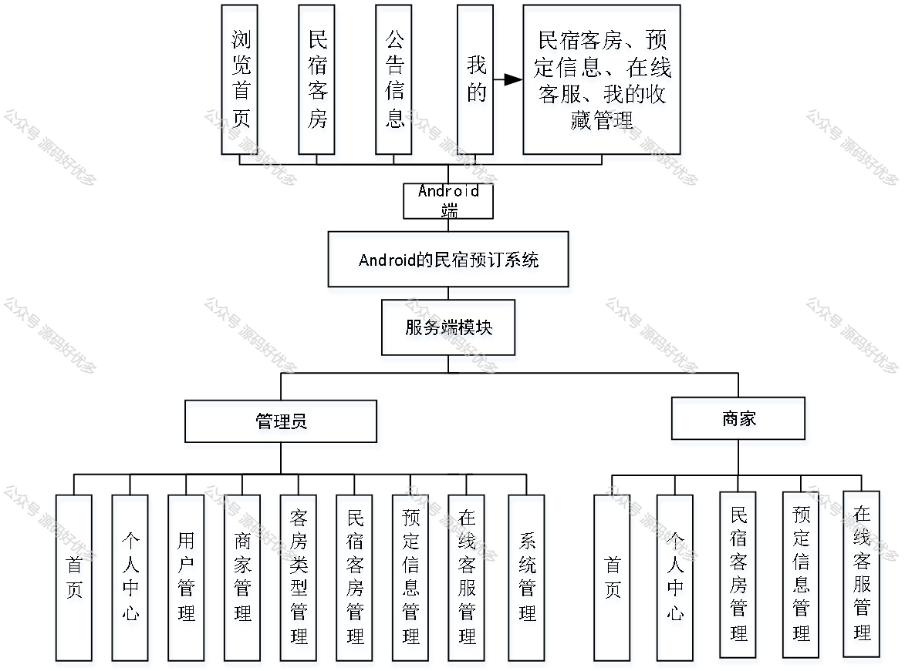
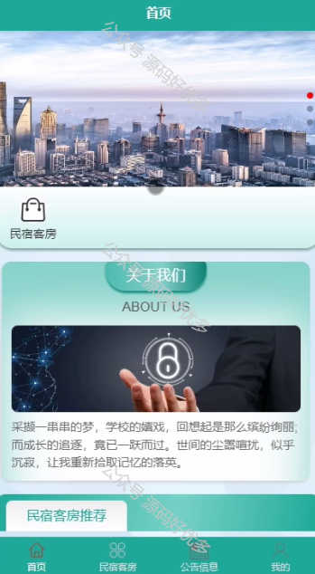
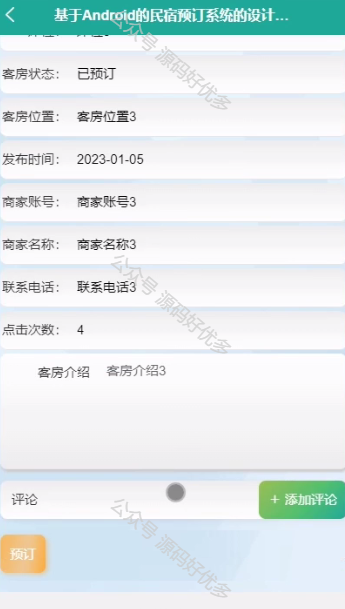
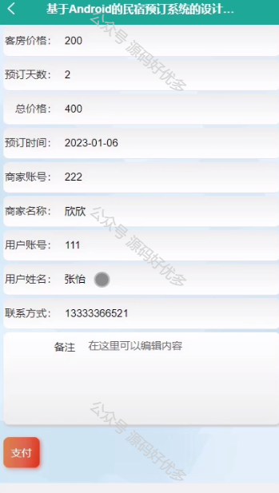
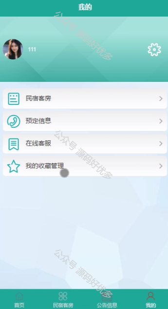
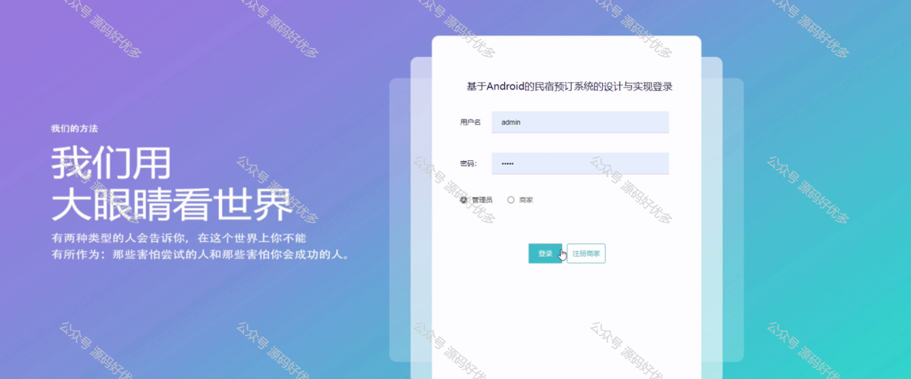
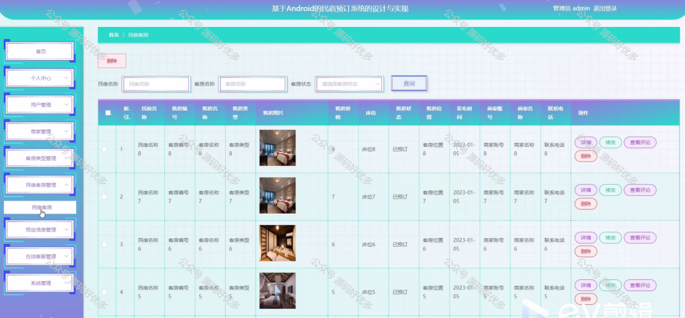
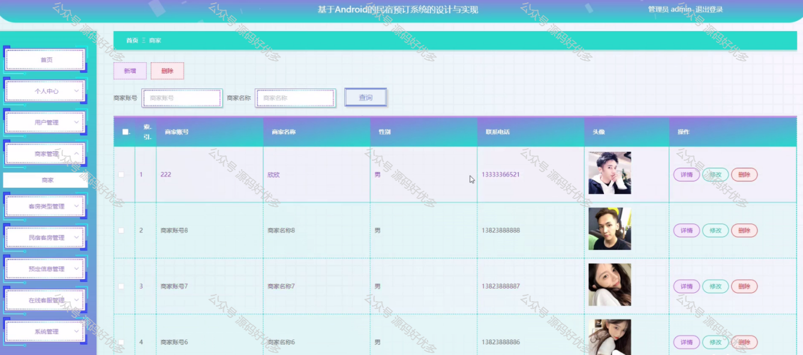
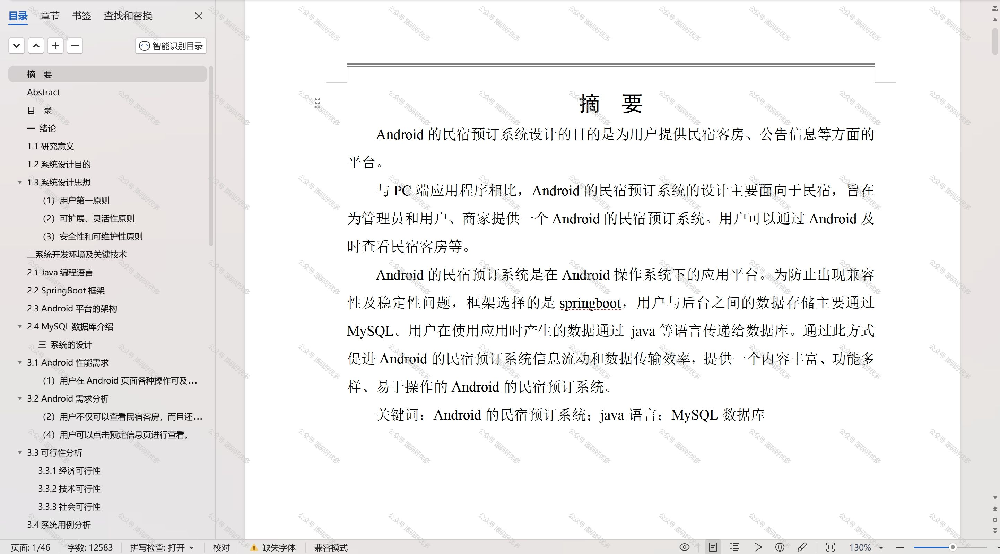

 
## 查看主页获取源码

> **作者介绍**： **✌**全网粉丝10W+本平台特邀作者、博客专家、CSDN新星计划导师、java领域优质创作者,博客之星、掘金/华为云/阿里云/InfoQ等平台优质作者、专注于项目实战 **✌**

  

### 一、作品包含

源码+数据库+设计文档万字+PPT+全套环境和工具资源+部署教程

### 二、项目技术

前端技术：Html、Css、Js、Vue、Element-ui

数据库：MySQL

后端技术：Java、Spring Boot、MyBatis

  

### 三、运行环境

开发工具：IDEA/eclipse + 微信开发者工具

数据库：MySQL5.7

数据库管理工具：Navicat10以上版本

环境配置软件： JDK1.8+Maven3.6.3

前端Nodejs：14

### 四、项目介绍
项目编号：mpweixinA042

民宿预订APP及微信小程序以我国日益增长的自由行和个性化旅游需求为背景，为广大旅行者提供便捷、多样化的民宿预订服务。通过整合优质民宿资源，为用户推荐合适的住宿方案，满足不同人群的出行需求，推动旅游住宿行业向更高效、个性化的方向发展。

前台用户功能：浏览首页、民宿客房、公告信息、预定信息、在线客服、我的收藏管理。

后台分为管理员和商家
管理员的功能：首页、个人中心、用户管理、商家管理、客房类型管理、民宿客房管理、预定信息管理、在线客服管理和系统管理。
商家的功能：首页、个人中心、民宿客房管理、预定信息管理和在线客服管理。

### 五、运行截图

  
